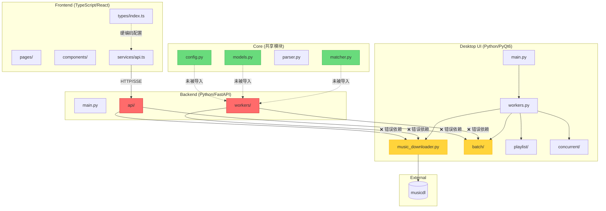
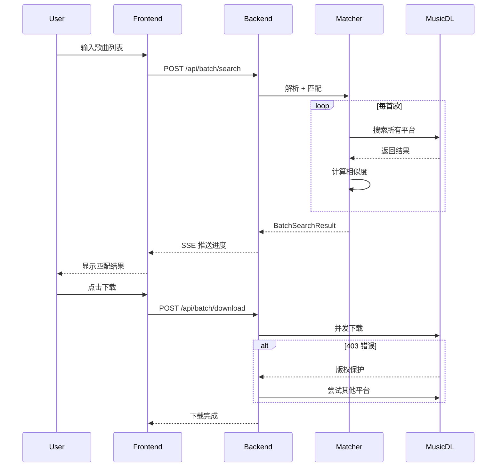
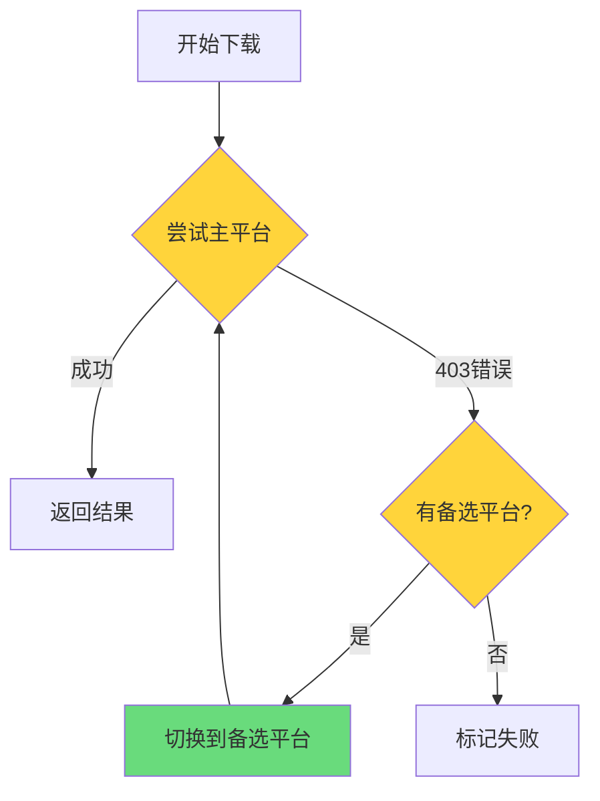
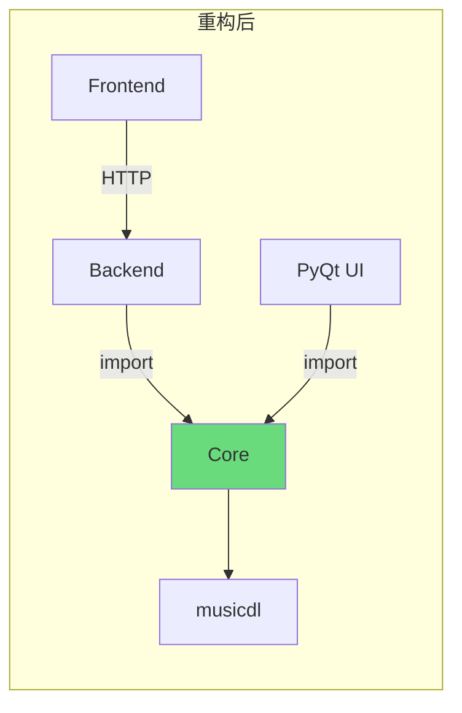

# 音乐下载软件代码结构分析报告

**生成时间**: 2026-03-02
**工具**: 代码探索 + 手动分析

---

## 1. 项目概览

| 指标 | 数值 |
|------|------|
| 主要模块 | 4 个 (pyqt_ui, backend, frontend, core) |
| 代码重复 | 4 处严重重复 |
| 架构问题 | 后端直接依赖 PyQt 模块 |
| 配置散落 | 3+ 处音乐源定义 |

---

## 2. 模块架构图 (Mermaid)



---

## 3. 代码重复问题

### 3.1 重复文件对比表

| 文件类型 | core/ 版本 | pyqt_ui/batch/ 版本 | 差异 |
|---------|-----------|-------------------|------|
| `matcher.py` | 131 行 (完整) | 96 行 (简化) | core 多 `calculate_similarity_breakdown()` |
| `models.py` | 180 行 | 182 行 | 几乎相同 |
| `parser.py` | 93 行 (完整) | 46 行 (简化) | core 多 `parse_with_album()` |
| `config.py` | 音乐源配置 | 音乐源配置 + UI常量 | 配置重复 + UI扩展 |

### 3.2 重复代码示例

**matcher.py 权重配置 (两处完全相同):**
```python
# core/matcher.py:16-18
name_weight = 0.5
singer_weight = 0.4
album_weight = 0.1

# pyqt_ui/batch/matcher.py:10-12 (完全相同)
name_weight = 0.5
singer_weight = 0.4
album_weight = 0.1
```

---

## 4. 跨模块依赖问题

### 4.1 后端错误依赖 PyQt 模块

```python
# backend/api/search.py:11-12
from pyqt_ui.music_downloader import MusicDownloader
from pyqt_ui.config import DEFAULT_SOURCES, SOURCE_LABELS

# backend/workers/concurrent_search.py:17-21
from pyqt_ui.music_downloader import MusicDownloader
from pyqt_ui.batch.parser import BatchParser
from pyqt_ui.batch.matcher import SongMatcher
from pyqt_ui.batch.models import BatchSongMatch, MatchCandidate
```

**问题影响:**
- Web 后端无法独立部署（需要安装 PyQt6）
- 容器化复杂度增加
- 违反分层架构原则

### 4.2 core/ 目录未被使用

`core/` 已创建完整实现，但未被任何模块引用：

```
core/
├── config.py      # 未被使用
├── models.py      # 未被使用 (完整版 BatchSongMatch)
├── parser.py      # 未被使用 (完整版解析器)
└── matcher.py     # 未被使用 (完整版匹配算法)
```

---

## 5. 配置散落问题

### 5.1 音乐源配置 (3处定义)

```python
# core/config.py:22-35
DEFAULT_SOURCES = ['QQMusicClient', 'NeteaseMusicClient', ...]
SOURCE_LABELS = {'QQMusicClient': 'QQ音乐', ...}

# pyqt_ui/config.py:17-29 (重复)
DEFAULT_SOURCES = ['QQMusicClient', 'NeteaseMusicClient', ...]
SOURCE_LABELS = {'QQMusicClient': 'QQ音乐', ...}
```

```typescript
// frontend/src/types/index.ts:173-178 (硬编码)
export const SOURCES: Source[] = [
  { value: 'QQMusicClient', label: 'QQ音乐' },
  { value: 'NeteaseMusicClient', label: '网易云' },
  ...
];
```

### 5.2 相似度阈值配置 (多处)

| 位置 | 阈值 | 用途 |
|------|------|------|
| `core/matcher.py:14` | 0.4 | Python 匹配阈值 |
| `pyqt_ui/batch/matcher.py:8` | 0.4 | Python 匹配阈值 |
| `frontend/src/types/index.ts` | 0.5-0.7 | 前端匹配模式 |

---

## 6. 执行流程图

### 6.1 批量下载流程



### 6.2 多源回退机制



---

## 7. 优化建议

### 7.1 架构重构方案



### 7.2 具体行动项

| 优先级 | 任务 | 影响 |
|--------|------|------|
| **P0** | 消除 `backend/` 对 `pyqt_ui/` 的依赖 | 架构解耦 |
| **P0** | 统一使用 `core/` 模块 | 消除重复 |
| **P1** | 音乐源配置集中到 `core/config.py` | 配置统一 |
| **P1** | 前端通过 API 获取音乐源 | 动态配置 |
| **P2** | 使用 OpenAPI 生成 TypeScript 类型 | 类型同步 |

### 7.3 重构步骤

1. **Phase 1**: 将 `pyqt_ui/batch/` 的差异合并到 `core/`
2. **Phase 2**: 修改 `backend/` 导入路径从 `pyqt_ui` 改为 `core`
3. **Phase 3**: 添加 API 端点 `/api/config/sources`
4. **Phase 4**: 前端动态获取音乐源配置

---

## 8. 附录：文件统计

| 模块 | 文件数 | 主要语言 |
|------|--------|---------|
| pyqt_ui/ | 20+ | Python |
| backend/ | 10+ | Python |
| frontend/src/ | 15+ | TypeScript |
| core/ | 4 | Python |

**关键文件:**
- `pyqt_ui/workers.py` (522 行) - 最大文件
- `frontend/src/pages/BatchDownloadPage.tsx` (500+ 行)
- `backend/workers/concurrent_search.py` (250+ 行)